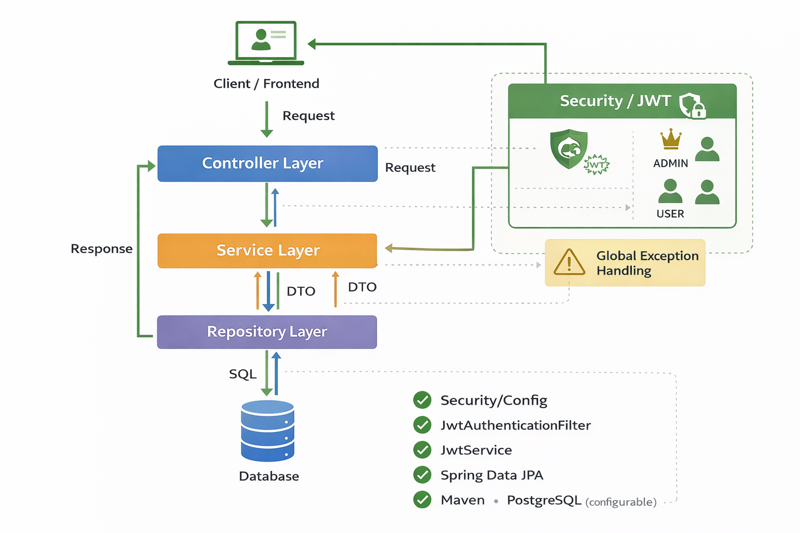
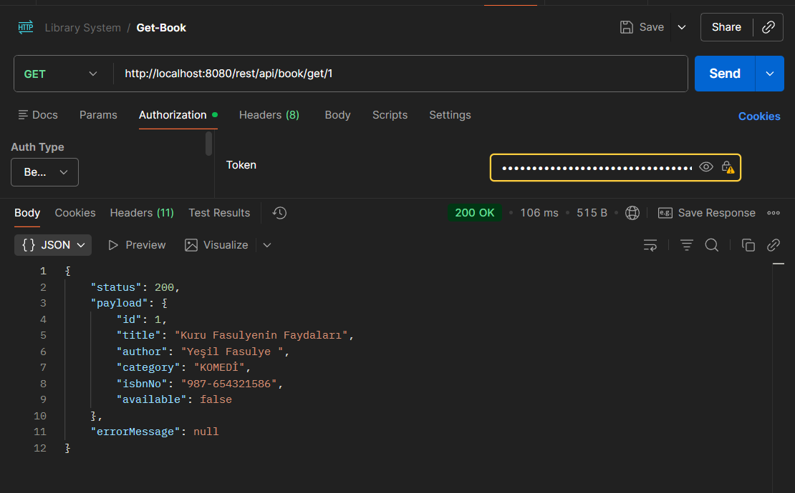
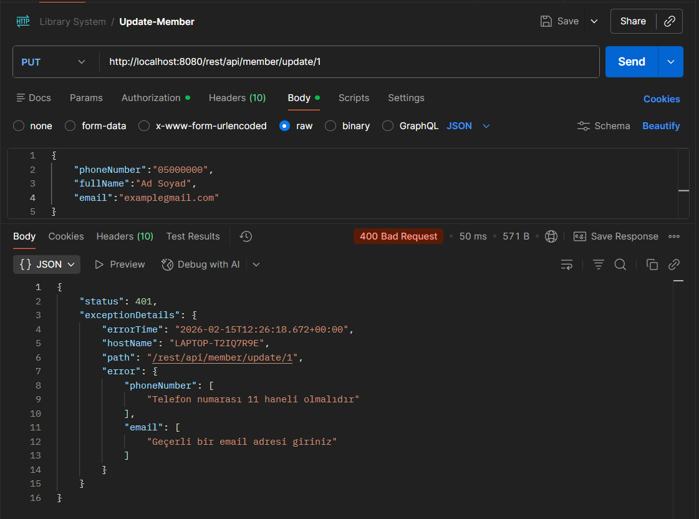
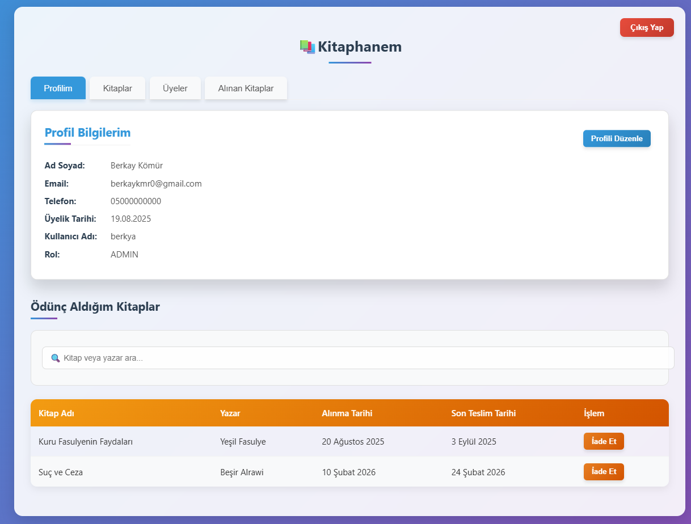
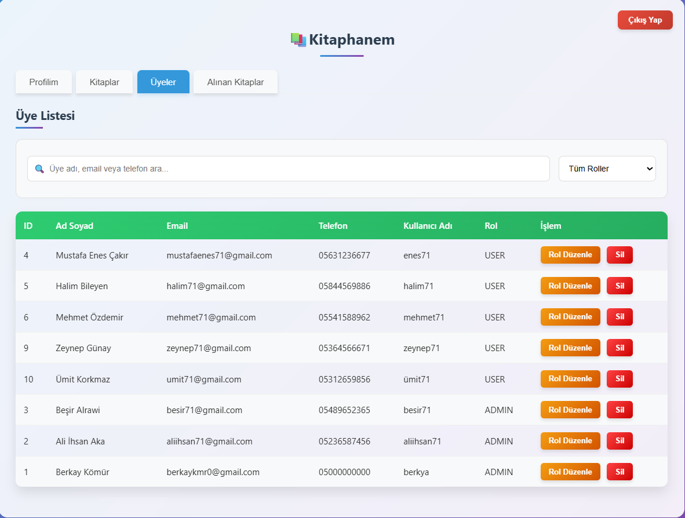
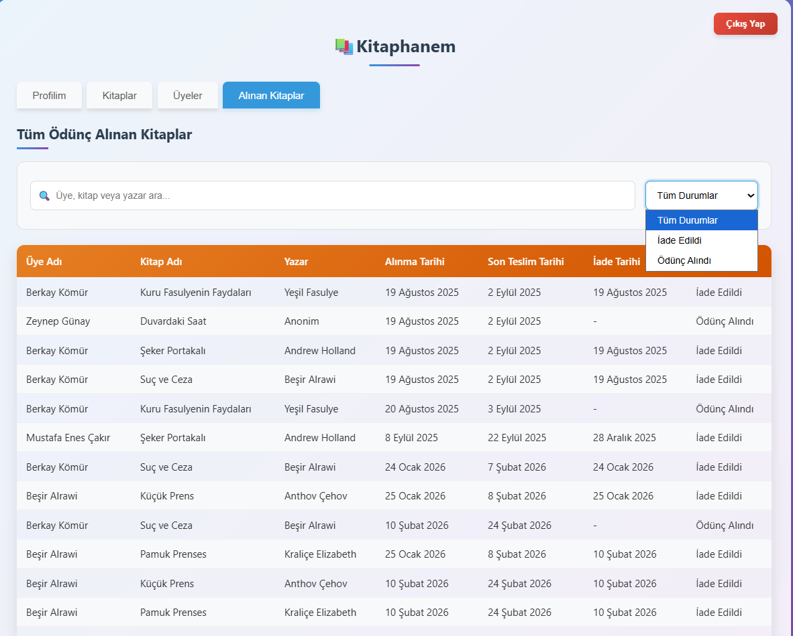
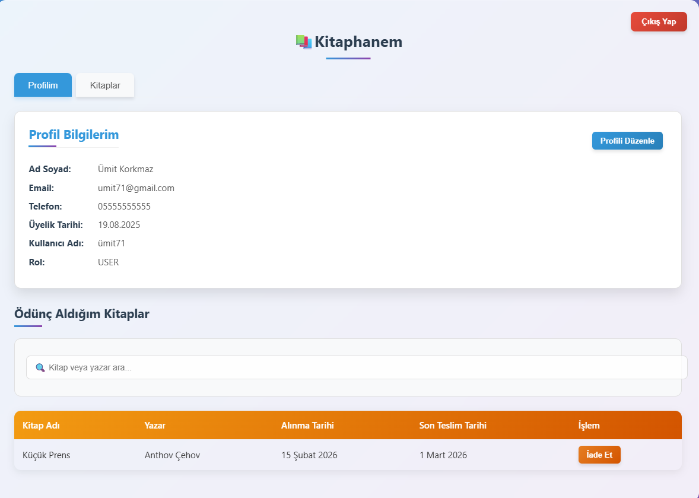

# 📚 Library Management System (Spring Boot)
A secure and layered **Library Management System** built with Spring Boot, implementing authentication, authorization (JWT), role-based access control, and a structured REST API architecture.

---

## 🚀 Features
- 🔐 JWT Authentication & Authorization
- 👥 Role-based access control (ADMIN, USER)
- 📖 Book management 
- 🧑 Member management
- 🔄 Loan system (borrow / return books)
- ♻️ Refresh token mechanism
- 🧩 Global exception handling
- 🏗 Layered Architecture (Controller → Service → Repository)
- 📦 DTO-based data transfer
- 🛡 Spring Security integration

---

## 🏛 Project Architecture

The project follows a clean layered architecture.



---

## 📂 Package Structure
- `config` → Security & application configuration  
- `controller` → REST endpoints  
- `dto` → Data Transfer Objects  
- `enums` → Role definitions  
- `exception` → Custom exception structure  
- `handler` → Global exception handler  
- `jwt` → JWT filter & token service  
- `model` → Entity classes  
- `repository` → JPA repositories  
- `service` → Business logic layer  

---

## 🔐 Authentication Flow
1. User registers  
2. User logs in  
3. Server returns:  
   - Access Token (JWT)  
   - Refresh Token  
4. Access token is used for protected endpoints  
5. When expired → refresh token generates new access token  

Security is configured using:  

- `SecurityConfig`  
- `JwtAuthenticationFilter`  
- `JwtService`  
- `UserSecurityService` (for ownership checks)  

---

## 🧠 Roles & Authorization

### ADMIN
- Full access to all endpoints

### USER
- Limited access  
- Can only access their own data

**Example:**

```java
@PreAuthorize("hasRole('ADMIN') or @userSecurityService.isOwner(authentication, #id)")
```

## 📚 Core Modules
### 📖 Book
- Create book  
- Update book  
- Delete book  
- List all books  

### 🧑 Member
- Register member  
- Update member  
- List members  

### 🔄 Loan
- Borrow book  
- Return book  
- Track active loans  

---

## 🛠 Technologies Used
- Java 17+  
- Spring Boot  
- Spring Security  
- Spring Data JPA  
- JWT  
- Maven  
- PostgreSQL (configurable)  

---

## ⚙️ How to Run

### 1️⃣ Clone the repository
```bash
git clone https://github.com/berkya0/Library-Management-System.git
```
2️⃣ Configure Database
Update application.properties:
```
spring.datasource.url=jdbc:postgresql://localhost:5432/library
spring.datasource.username=your_username
spring.datasource.password=your_password
```

3️⃣ Run the project
```
./mvnw spring-boot:run
```
or
```
mvn spring-boot:run
```

## 🧪 API Testing
The API can be tested using the following tools:

- **Postman** → Send HTTP requests (GET, POST, PUT, DELETE) 
- **Browser** → For static authentication pages  

---
📸 Postman Example






## 🌐 Available Static Pages
The project includes simple frontend pages for authentication testing:

- `/login.html` → User login page  
- `/register.html` → User registration page  
- `/dashboard.html` → Protected dashboard page (requires authentication)
 
📸 Dashboard Page









---

## 🎯 What I Practiced in This Project
Through this project, I focused on:

- Designing a secure REST API architecture  
- Implementing JWT-based authentication from scratch  
- Creating a refresh token mechanism  
- Applying role-based and ownership-based authorization  
- Structuring a layered architecture (Controller → Service → Repository)  
- Implementing global exception handling  
- Using DTOs to separate internal entities from API responses  
- Integrating Spring Security with method-level protection  

---

## 📌 Future Improvements
Planned enhancements:

- Add Swagger/OpenAPI documentation  
- Implement pagination and sorting  
- Add Docker support  
- Write unit and integration tests  
- Implement audit logging  
- Set up CI/CD pipeline  

---

## 👨‍💻 Author

**Berkay Kömür**  
Computer Engineering Student | Java & Spring Boot Enthusiast 🚀

